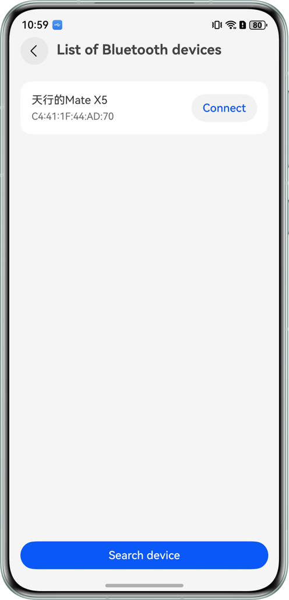
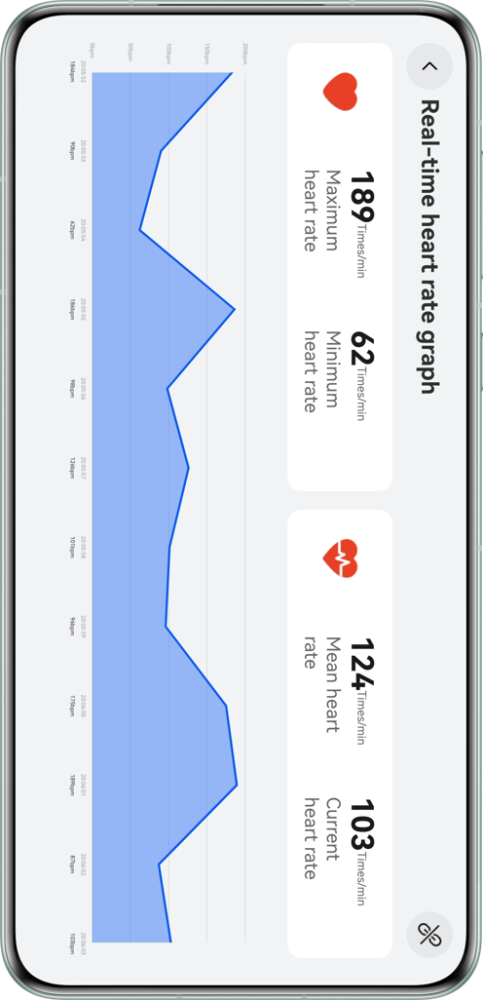
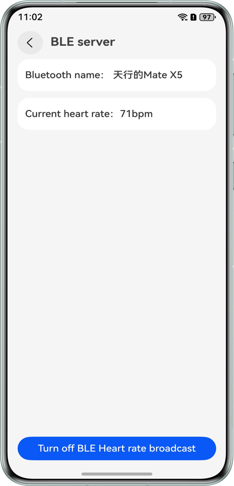

# Implementing Device Communication Using BLE

## Overview
Bluetooth Low Energy (BLE) is a wireless, low-power Bluetooth technology. Compared with classic Bluetooth, BLE allows for lower power consumption and is applicable to devices with long standby time, such as smart watches, healthcare devices, smart home devices. 
This sample describes the capabilities of connecting and communicating devices through Bluetooth. For example, the BLE server can transmit data after advertising is enabled, and the BLE client can search for connectable devices and receive advertising data after connection.

## Preview
|           Client-Side Device Discovery           |        Client-Side Heart Rate Monitoring         |         Server-Side Heart Rate Broadcast         |
| :----------------------------------------------: | :----------------------------------------------: | :----------------------------------------------: |
|  |  |  |

## How to Use
Two devices are required. One functions as the BLE server, and the other functions as the BLE client.
* BLE server

  Touch the heart rate advertising button to transmit data.
* BLE client

  Search for connectable Bluetooth devices, receive data after the connection is successful, and display the heart rate in a line graph.

## Project Directory

``` 
├──entry/src/main/ets                                   
│  ├──contants
│  │  └──CommonConstants.ets                            // Constants
│  ├──entryability
│  │  └──EntryAbility.ets                               // Program entry class
│  ├──entrybackupability
│  │  └──EntryBackupAbility.ets                         // Backup and recovery class
│  ├──model
│  │  └──BluetoothDevice.ets                            // Bluetooth device
│  ├──pages
│  │  ├──client
│  │  │  ├──model
│  │  │  │  └──BluetoothClientModel.ets                 // Bluetooth client model layer (business logic layer)
│  │  │  ├──view
│  │  │  │  ├──BluetoothClientView.ets                  // Bluetooth client page
│  │  │  │  └──HeartRateView.ets                        // Heart rate line chart page
│  │  │  └──BluetoothClientViewModel.ets                // Bluetooth client ViewModel layer (UI driver layer)
│  │  ├──server
│  │  │  ├──model
│  │  │  │  └──BluetoothServerModel.ets                 // Bluetooth server model layer (business logic layer)
│  │  │  ├──view
│  │  │  │  └──BluetoothServerView.ets                  // Bluetooth server page
│  │  │  └──BluetoothServerViewModel.ets                // Bluetooth server ViewModel layer (UI driver layer)
│  │  └──Index.ets                                      // Home page
│  ├──uicomponents                              
│  │  ├──HeartRateGraph.ets                             // Line chart UI component
│  │  └──NavigationBar.ets                              // Navigation bar component
│  └──utils                              
│     ├──CommonUtils.ets                                // Common utility class
│     └──Logger.ets                                     // Log printing utility class
└──entry/src/main/resources                             // Application resource directory

```

## Implementation Details
> * BLE server
>   
>   Call startAdvertising to start advertising.
>   
>   Call stopAdvertising to stop advertising when the device is disconnected.
>   
> * BLE client
>
>   Call startBLEScan to search for Bluetooth-enabled devices.
>
>   Call connect to connect to the Bluetooth.
>
>   Call on(type: 'BLECharacteristicChange') to subscribe to value changes of the BLE characteristics.
>

### Client ViewModel Layer Key Interface

| Method/Property             | Type Definition                                    | Description                                                  |
| --------------------------- | -------------------------------------------------- | ------------------------------------------------------------ |
| getInstance                 | static getInstance(): BluetoothClientViewModel     | Get the singleton instance of the client ViewModel.          |
| tryAutoReconnect            | async tryAutoReconnect(): Promise\<boolean\>       | Attempt to automatically reconnect based on system-persisted device addresses. |
| startBLEScan                | startBLEScan(): boolean                            | Start BLE scanning. Will prompt to enable Bluetooth if not ready. |
| stopBLEScan                 | stopBLEScan(): void                                | Stop BLE scanning.                                           |
| connect                     | connect(bluetoothDevice: BluetoothDevice): boolean | Initiate connection to the specified Bluetooth device.       |
| disconnect                  | disconnect(): void                                 | Disconnect from the current device.                          |
| close                       | close(): void                                      | Close GATT connection (release resources)                    |
| changeConnectState          | changeConnectState(): void                         | Reset connection state to disconnected (for timeout scenarios, etc.) |
| deleteDeviceById            | deleteDeviceById(deviceId?: string): void          | Delete device record by ID (including from persistent storage) |
| resetHeartRateStatistics    | resetHeartRateStatistics(): void                   | Reset heart rate statistics (max/min/average/sample count)   |
| resetHeartRateValue         | resetHeartRateValue(): void                        | Reset the current heart rate to zero                         |
| availableDevices            | Array                                              | List of available BLE devices (@Trace)                       |
| connectBluetoothDevice      | BluetoothDevice                                    | Currently connected device (@Trace)                          |
| heartRate                   | number                                             | Current heart rate (@Trace)                                  |
| heartRateTop/Bottom/Average | number                                             | Heart rate statistics (max/min/average) (@Trace)             |
| persistentDeviceIds         | string[]                                           | List of system-persisted random addresses (@Trace)           |
| lastConnectedDevice         | BluetoothDevice                                    | Most recently connected device (@Trace)                      |
| bluetoothEnable             | boolean                                            | Bluetooth adapter enabled state (@Trace)                     |

### Server ViewModel Layer Key Interface

| Method/Property      | Type Definition                                | Description                                                  |
| -------------------- | ---------------------------------------------- | ------------------------------------------------------------ |
| getInstance          | static getInstance(): BluetoothServerViewModel | Get the singleton instance of the server ViewModel.          |
| toggleAdvertiser     | toggleAdvertiser(): void                       | Toggle advertising state; validates local device name length; starts/stops periodic heart rate broadcast. |
| stopAdvertiser       | stopAdvertiser(): void                         | Stop advertising and release GATT Server resources.          |
| deviceId             | string                                         | Random address of the currently connected device (@Trace)    |
| bluetoothEnable      | boolean                                        | Bluetooth adapter enabled state (@Trace)                     |
| startAdvertiserState | boolean                                        | Indicates whether advertising is currently active (@Trace)   |
| localName            | string                                         | Local Bluetooth device name (@Trace)                         |
| heartRate            | number                                         | Current simulated heart rate value being broadcast (demo value; @Trace) |

## Required Permissions

1. ohos.permission.ACCESS_BLUETOOTH
   Allows apps to access Bluetooth capabilities, including pairing and connecting peripheral devices.

2. ohos.permission.PERSISTENT_BLUETOOTH_PEER_MAC
   Allows apps to persistently store virtual addresses mapped to peer Bluetooth device MACs for fast BLE reconnection.

## Constraints and Limitations

* The sample is only supported on Huawei phones with standard systems.

* The HarmonyOS version must be HarmonyOS 6.0.0 Release or later.

* The DevEco Studio version must be DevEco Studio 6.0.0 Release or later.

* The HarmonyOS SDK version must be HarmonyOS 6.0.0 Release SDK or later.
